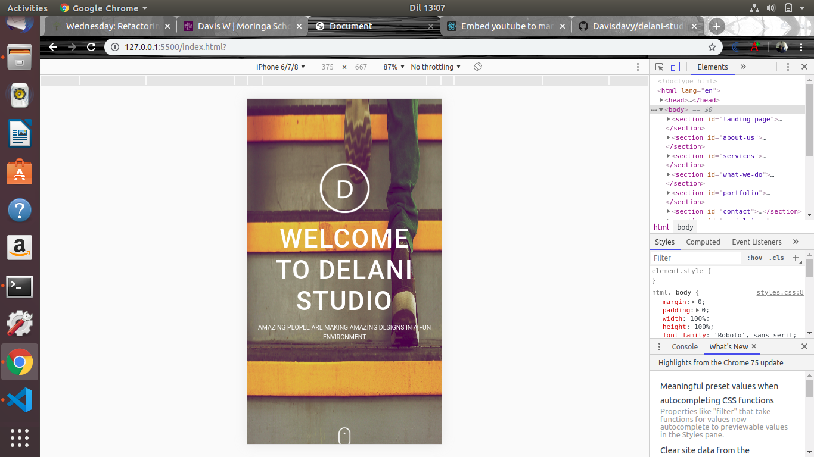
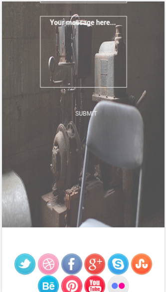
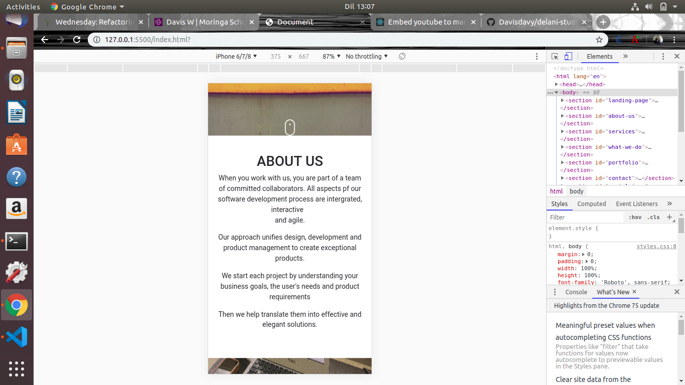
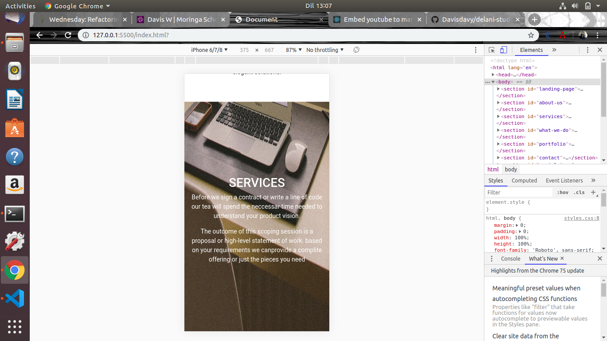
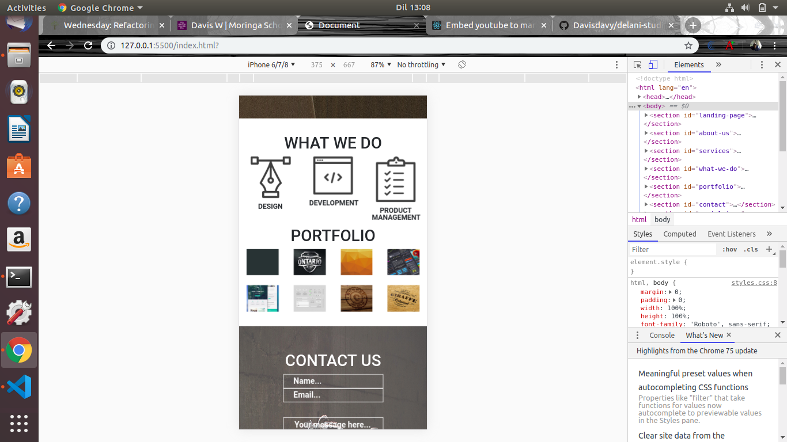

# DELANI STUDIO
#### Fictional Studio Website, Sat, 8 June.
#### By Davis

## Behaviour Driven Development (BDD)
| Behaviour expected to be handled | Hover and Click Example            | Output Example            |
| -------------------------------- | -------------------------- |------------------------------------            
|Hover Effect                      |  portfolio images  |  An overlay with the name of the project|
|Click and Toggle                  | Click what we do icons|Toggles with a paragrapgh description|
|Send Message                      | Complite field fill| Congratulation alert boX|

## Video Demo

### Description
This website cases what the artist has done (projects) and an about him page where you could
contact him through a direct web message or social media ways.
It is only a fictional but functional website.

### Mobile Resolution veiw

## Setup/Installation Requirements
 To set up, click the link and redirected to a working github page website.
* Chrome/safari/IE
## Known Bugs
The web functionality is best in an internet connected. 
## Technologies Used
  #### HTML
    This was the solid foundation language used to create the skeleton of the web.
  #### Css 
    Styled the sizings, postionings and altered some default bootstrap
  #### Bootstrap
    This framework was strategically used to style the button.rows and columns.
  #### Javascript
    The alert pop up after submitting a message form was created by this language
  #### Jquery
    This library  handled the hover and toggle events.
## Support and contact details
  Want to get in touch?
  Email me 
  slack Davis W
  Github Davisdavy
### License
MIT License

Copyright (c) [2019] [Davis Wafula]

Permission is hereby granted, free of charge, to any person obtaining a copy
of this software and associated documentation files (the "Software"), to deal
in the Software without restriction, including without limitation the rights
to use, copy, modify, merge, publish, distribute, sublicense, and/or sell
copies of the Software, and to permit persons to whom the Software is
furnished to do so, subject to the following conditions:

The above copyright notice and this permission notice shall be included in all
copies or substantial portions of the Software.

THE SOFTWARE IS PROVIDED "AS IS", WITHOUT WARRANTY OF ANY KIND, EXPRESS OR
IMPLIED, INCLUDING BUT NOT LIMITED TO THE WARRANTIES OF MERCHANTABILITY,
FITNESS FOR A PARTICULAR PURPOSE AND NONINFRINGEMENT. IN NO EVENT SHALL THE
AUTHORS OR COPYRIGHT HOLDERS BE LIABLE FOR ANY CLAIM, DAMAGES OR OTHER
LIABILITY, WHETHER IN AN ACTION OF CONTRACT, TORT OR OTHERWISE, ARISING FROM,
OUT OF OR IN CONNECTION WITH THE SOFTWARE OR THE USE OR OTHER DEALINGS IN THE
SOFTWARE.**{List of contributors or company name}**

